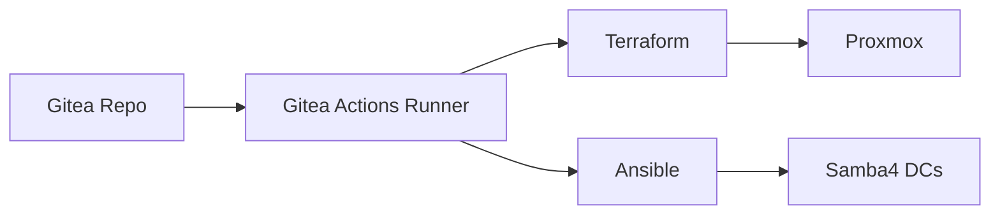
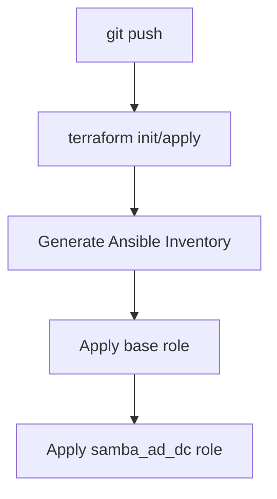
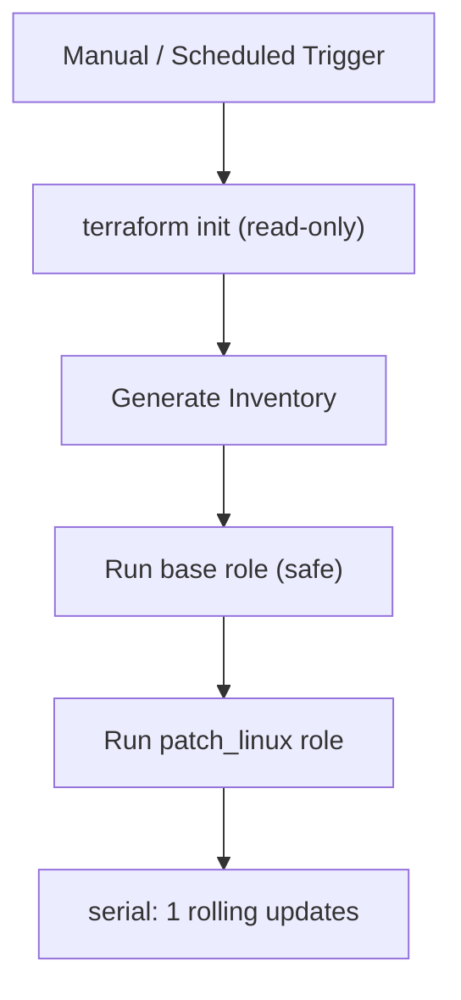

# stack-samba4-dc

This repository defines a complete, deployable stack for provisioning and maintaining Samba4 Active Directory Domain Controllers in my homelab.

It composes reusable platform components with stack-specific configuration and CI/CD workflows.

---

## Purpose

This repository answers one question:

What does it take to stand up and operate Samba4 domain controllers in this environment?

It is:
- Environment-specific
- Fully automated
- Safe to re-run
- Designed for both provisioning and ongoing maintenance

---

## High-Level Architecture



---

## Provisioning Workflow (dc-apply.yml)

Triggered on pushes to the main branch.



Flow:
1. Terraform provisions Proxmox virtual machines
2. Terraform outputs are converted into Ansible inventory
3. Ansible applies:
   - base role from infra-platform
   - samba_ad_dc role from this repository

The workflow is declarative and idempotent.

---

## Maintenance Workflow (maintenance.yml)

Triggered manually or on a schedule.



Designed to patch domain controllers safely without unintended configuration changes.

---

## Repository Structure

```text
terraform/
  envs/home/

ansible/
  playbooks/
  roles/
  inventories/

.gitea/workflows/
  dc-apply.yml
  maintenance.yml
```

---

## Dependency Management

This stack pins its dependencies explicitly.

- infra-platform Terraform modules are referenced by tag
- infra-platform Ansible roles are cloned at fixed versions

Upgrades occur only when the platform version is intentionally bumped.

---

## Secrets Handling

Secrets are never committed.

They are injected at runtime using:
- Gitea secrets
- Ansible Vault

Examples include:
- Proxmox API credentials
- SSH private keys
- Vault passwords

---

## Operational Usage

Initial deployment:
- Push to main branch triggers dc-apply workflow

Maintenance:
- Manually trigger maintenance workflow
- Or allow scheduled patching

---

## Design Principles

- Separation of concerns between platform and stack
- Explicit versioning and upgrades
- Safe idempotent execution
- Clear distinction between provisioning and maintenance

If this repository is green, the domain controllers are healthy.
